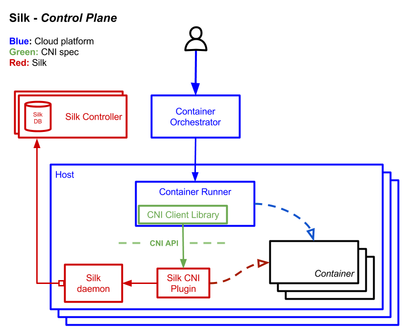
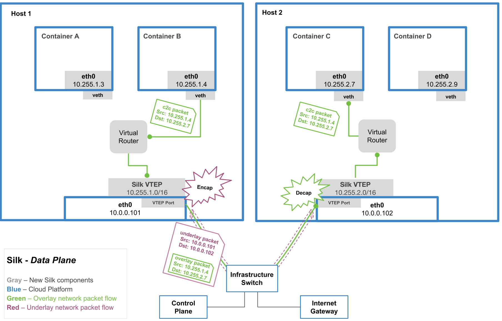

# Silk

> Note: This repository should be imported as `code.cloudfoundry.org/silk`.

Silk is an open-source, [CNI](https://github.com/containernetworking/cni/)-compatible container networking fabric.
It was inspired by [flannel](https://github.com/coreos/flannel) and designed to meet the strict operational
requirements of [Cloud Foundry](https://cloudfoundry.org/platform/).

To see how Silk is used inside of Cloud Foundry, look at the [CF Networking Release](https://github.com/cloudfoundry-incubator/cf-networking-release).

## Architecture

### Control plane

Silk has three components:

- `silk-controller` runs on at least one central node and manages IP subnet lease allocation across the cluster.
   It is implemented as a stateless HTTP JSON API backed by a SQL database.

- `silk-daemon` runs on each host in order to acquire and renew the subnet lease for that 

- `silk-cni` is a short-lived program, executed by the container runner, to set up the network stack for a particular container.

### Data plane

The Silk dataplane is a single shared [VXLAN](https://tools.ietf.org/html/rfc7348) overlay network where each
container host is assigned a unique IP subnet, and each container gets a unique IP from that subnet.

To provide multi-tenant network policy on top of this connectivity fabric, Cloud Foundry utilizes the
[VXLAN GBP](https://tools.ietf.org/html/draft-smith-vxlan-group-policy-03#section-2.1) extension to tag
egress packets with a policy identifier.  Other network policy enforcement schemes are also possible.
